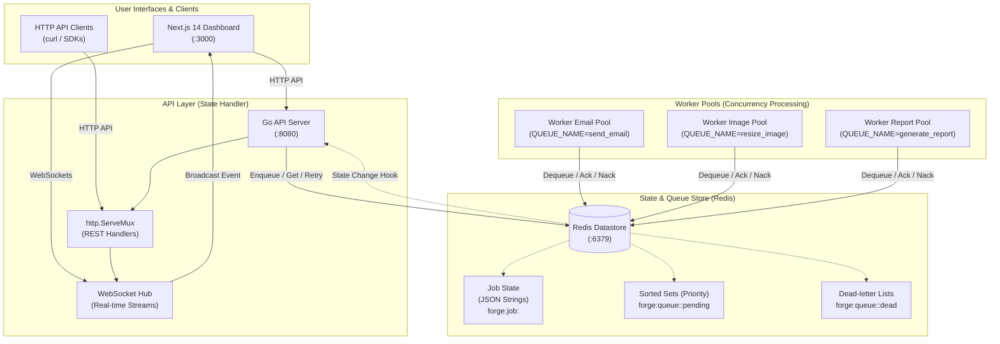
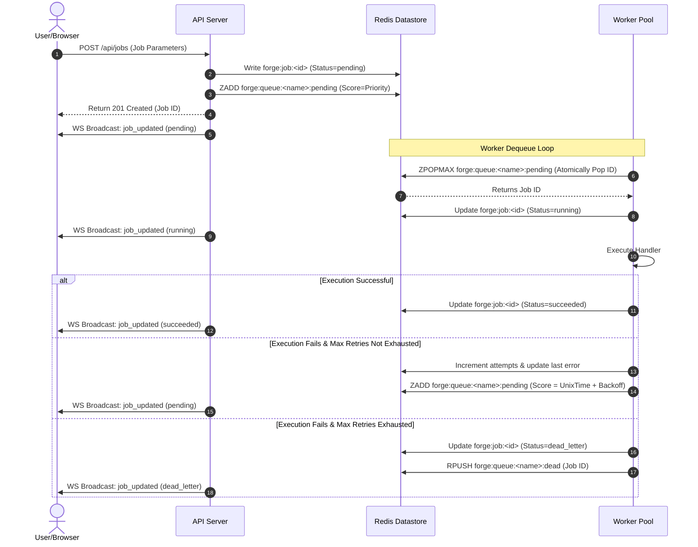

# Forge Distributed Task Queue Architecture

This document describes the high-level system architecture, data flow, component design, and underlying Redis data structures that power the Forge task queue.

---

## 1. System Architecture Diagram

---

## 2. Component Directory

### A. Next.js 14 Dashboard
- **Frontend App**: Built with TypeScript, React 18, and styled with glassmorphism CSS.
- **WebSocket Listener**: Subscribes to the Go API WebSocket gateway to stream job transitions (pending $\rightarrow$ running $\rightarrow$ completed) instantly.
- **Polling Loop**: Periodically requests active queue counts from `/api/queues` every 5 seconds to update the stats header.

### B. Go API Server
- **REST Engine**: Exposes `/api/jobs` for enqueuing new work, `/api/jobs/{id}` for querying, `/api/jobs/{id}/retry` for manual dead-letter release, and `/api/queues` for list views.
- **WebSocket Hub**: Standardizes connection register/unregister streams and coordinates non-blocking JSON event broadcasts (`job_updated`) to clients.
- **Graceful Shutdown**: Blocks on SIGINT/SIGTERM, giving HTTP requests 15 seconds to flush before terminating the server.

### C. Redis Queue Backend
- **Data Layer**: Translates logical queue calls into atomic Redis pipelines.
- **Queue Lister**: Scans for active queue namespaces in Redis to allow dynamic UI cards without configuration.

### D. Worker Pools
- **Goroutine Pools**: Coordinates worker routines executing concurrency slots using a worker channel + `sync.WaitGroup` framework.
- **Clean Interrupts**: Guarantees that in-flight jobs run to completion on shutdown (up to 30 seconds) before letting the process exit.

---

## 3. Redis Data Structures

Forge stores all parameters and tracks job schedules inside Redis using three key structures:

| Key Format | Type | Description |
| :--- | :--- | :--- |
| **`forge:job:<id>`** | `String` (JSON) | Stores the full job parameters (ID, Payload, MaxRetries, Attempts, Status, LastError, Timestamps). |
| **`forge:queue:<name>:pending`** | `Sorted Set (ZSET)` | Queue buffer where `Score = Priority` (highest priority popped first). If a job is back-off delayed, `Score = Unix Timestamp` when it becomes runable. |
| **`forge:queue:<name>:dead`** | `List (LPUSH)` | Stores the IDs of permanently failed jobs that require manual operator retry. |

---

## 4. Job Lifecycle & Technical Flow

